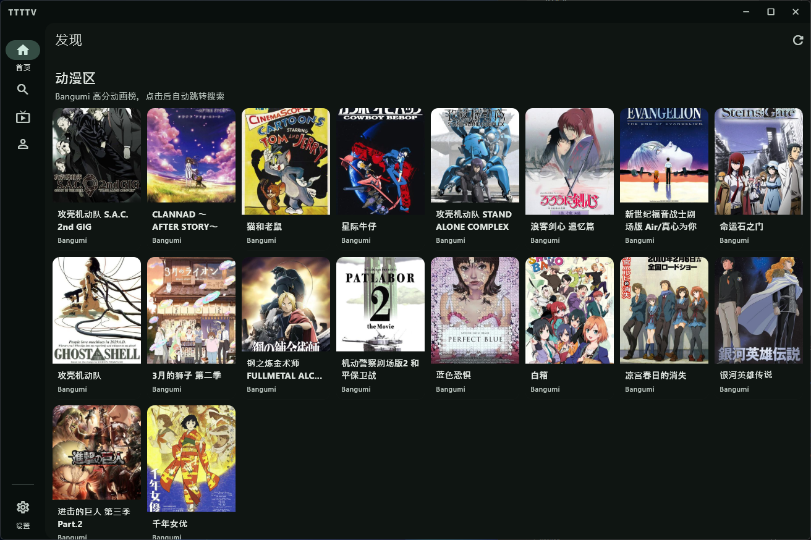
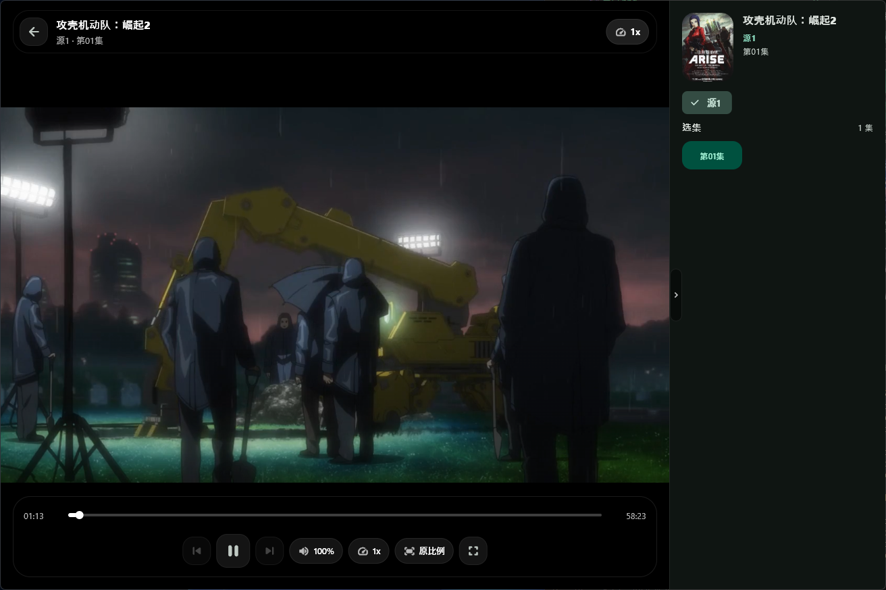
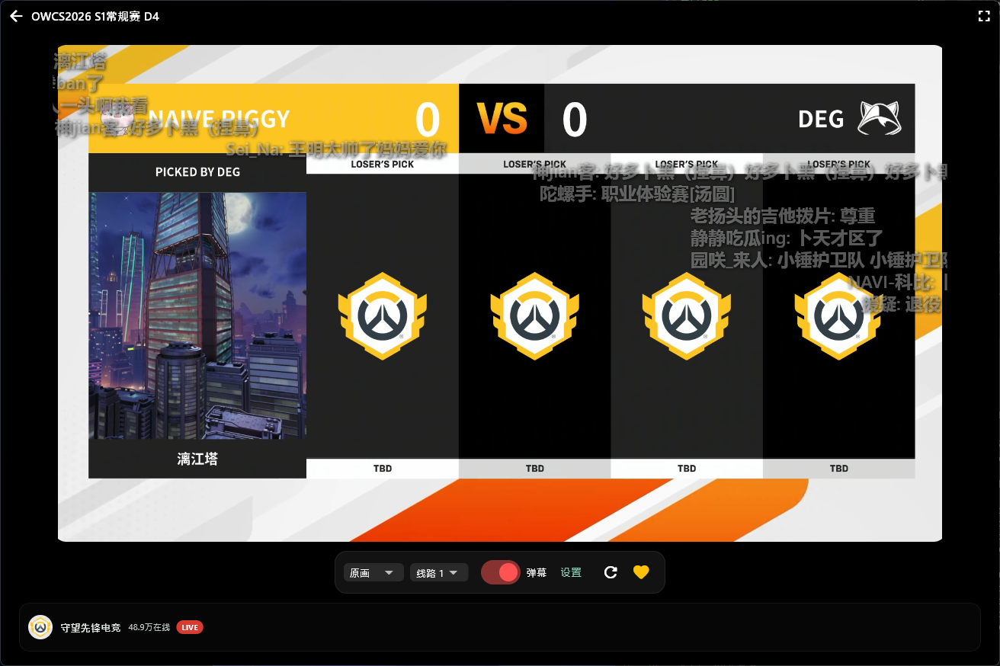
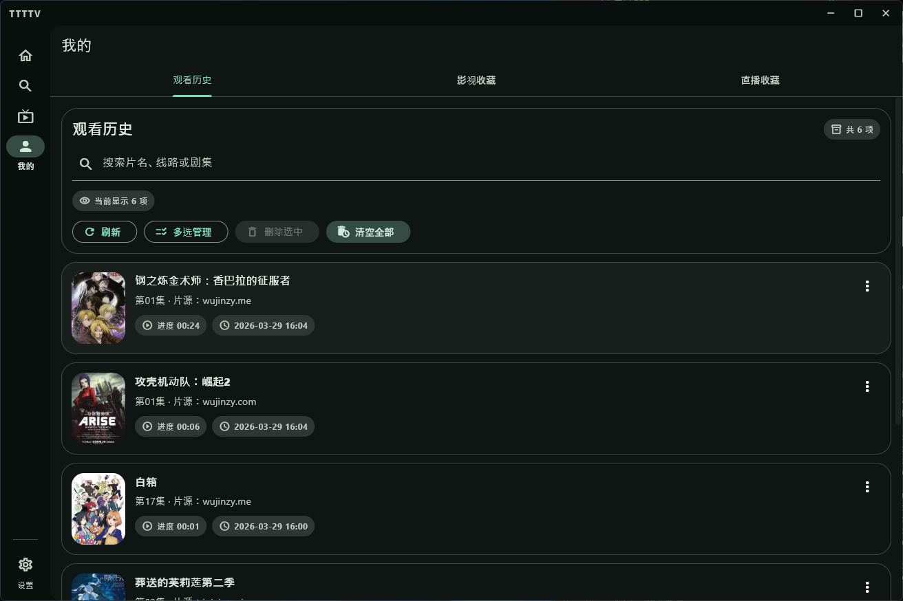
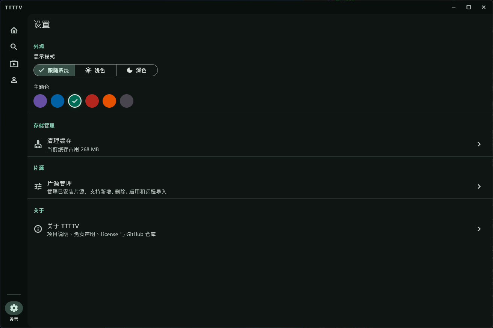

<p align="center">
  
</p>

<h1 align="center">TTTTV</h1>

<p align="center">
  Windows 桌面端影视 & 直播一站式观看工具<br/>
  搜索、播放、收藏，开箱即用，无需登录
</p>

<p align="center">
  
  
  
  
</p>

---

## 截图预览

<table>
  <tr>
    <td align="center"><b>影视首页</b></td>
    <td align="center"><b>影视播放</b></td>
    <td align="center"><b>直播首页</b></td>
  </tr>
  <tr>
    <td></td>
    <td></td>
    <td></td>
  </tr>
  <tr>
    <td align="center"><b>直播播放</b></td>
    <td align="center"><b>我的页面</b></td>
    <td align="center"><b>设置</b></td>
  </tr>
  <tr>
    <td></td>
    <td></td>
    <td></td>
  </tr>
</table>

---

## 功能亮点

- **影视搜索与播放** — 聚合多个片源，支持 HLS / M3U8 代理播放，解决防盗链问题
- **直播多平台** — 已接入哔哩哔哩、抖音、斗鱼、虎牙、快手及自定义 M3U 源
- **弹幕支持** — 直播间实时弹幕叠加显示
- **收藏 & 历史** — 影视收藏、直播间收藏、观看历史，本地持久化
- **影视 & 动漫榜单** — 首页展示热门影视与动漫推荐
- **片源管理** — 可在设置中自由添加、启用、排序片源
- **Windows 原生体验** — 全屏、窗口缩放、键盘快捷键完整支持

---

## 项目结构

```text
TTTTV-Flutter/
├── ttttv_flutter/                  # Flutter Windows 客户端
├── Moovie/                         # 影视模块后端（Rust + Axum）
├── build_windows_flutter_release.ps1  # 绿色版打包脚本
└── build_windows_installer.ps1        # Windows 安装包脚本
```

---

## 快速开始

### 前提

- [Flutter SDK](https://flutter.dev) (Windows desktop 支持已启用)
- [Rust 工具链](https://rustup.rs)

### 1. 启动后端

```powershell
cd TTTTV-Flutter\Moovie
cargo run
```

### 2. 启动前端

```powershell
cd TTTTV-Flutter	tttv_flutter
flutter pub get
flutter run -d windows
```

---

## 打包发布

打包前请先在 `ttttv_flutter\pubspec.yaml` 中修改版本号。

### 方法 A：一键脚本（推荐）

```powershell
cd TTTTV-Flutter

# 绿色免安装版
.\build_windows_flutter_release.ps1

# Windows 安装包
.\build_windows_installer.ps1
```

安装包输出路径：

```text
TTTTV-Flutter\build\installers\TTTTV-Windows-x.x.x-Setup.exe
```

### 方法 B：手动构建

```powershell
# 构建后端
cd TTTTV-Flutter\Moovie
cargo build --release

# 构建前端
cd TTTTV-Flutter	tttv_flutter
flutter build windows --release

# 复制后端可执行文件到发布目录
Copy-Item `
  TTTTV-Flutter\Moovie	arget
elease\moovie.exe `
  TTTTV-Flutter	tttv_flutter\build\windows\x64
unner\Release\moovie.exe `
  -Force
```

> 如需绿色启动，可在发布目录添加 `start_ttttv.bat`：
>
> ```bat
> @echo off
> cd /d %~dp0
> start "" /B moovie.exe
> timeout /t 2 /nobreak >nul
> start "" ttttv_flutter.exe
> ```

---

## 致谢

感谢社区 [linux.do](https://linux.do/) 的支持与反馈。

---

## License

[MIT](LICENSE)
