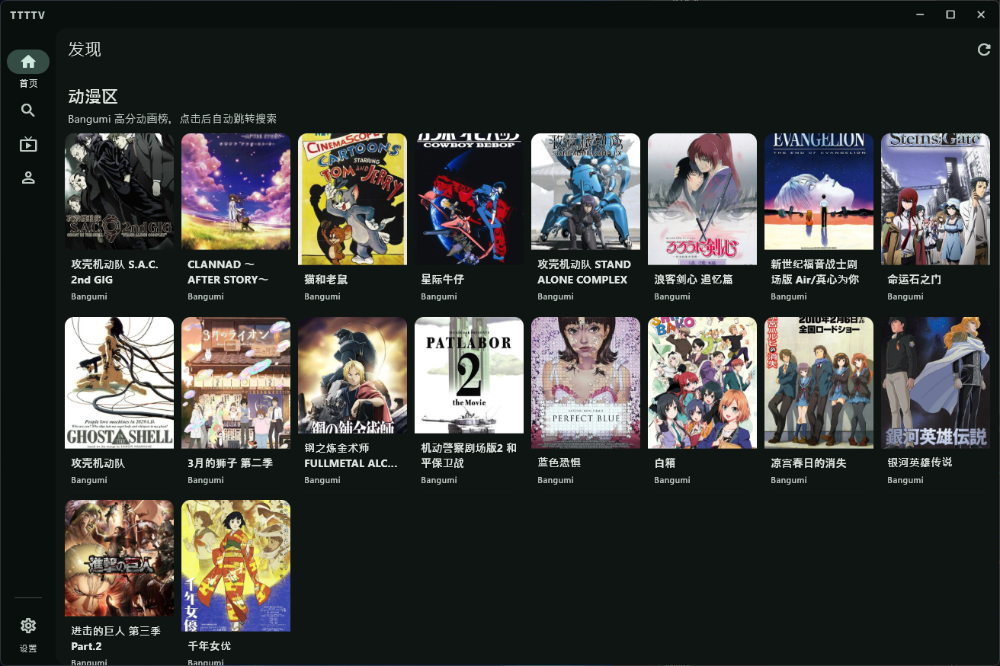
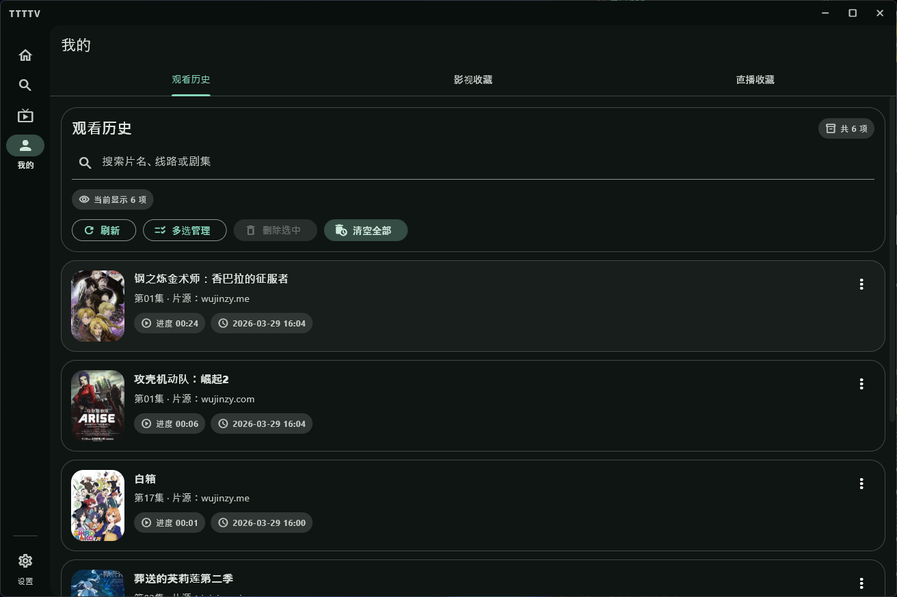
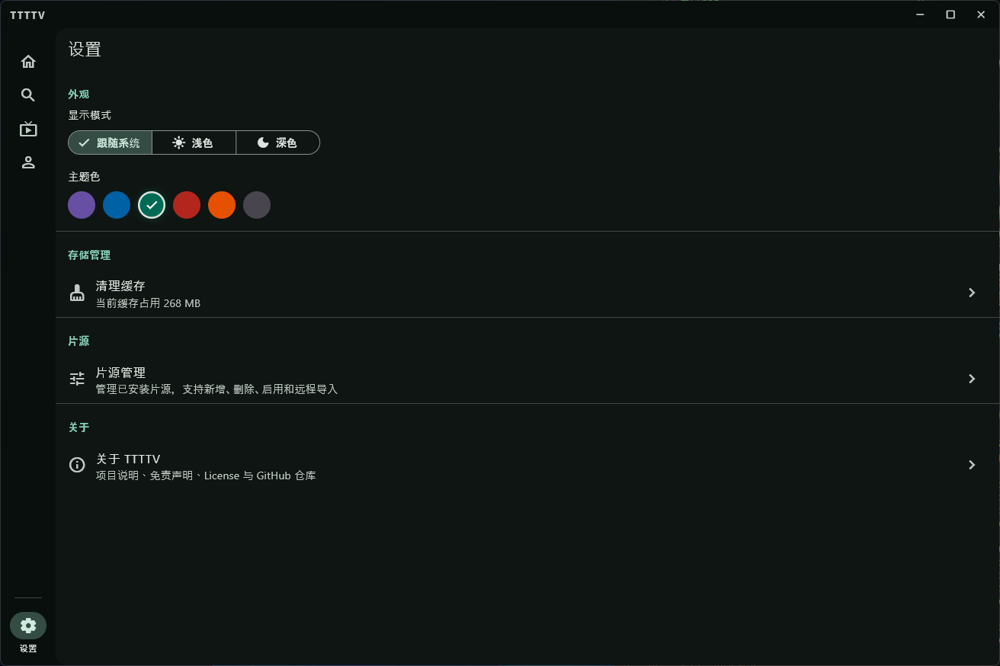

<p align="center">
  
</p>

<h1 align="center">TTTTV</h1>

<p align="center">
  一款面向中文用户的影视聚合播放器，兼顾桌面端沉浸体验与移动端观影效率。
</p>

<p align="center">
  影视搜索、在线播放、片源管理、历史记录、收藏体系、主题切换，集中在一个轻量、直接的 Flutter 客户端里。
</p>

---

## 告示

- 自 0.5.14 起，直播相关功能已不再维护。如仍需使用直播，请下载旧版本 release 或自行从旧版分支构建。
- 视频源插件完全兼容 LunaTV 格式。

## 项目简介

TTTTV 是一个用 Flutter 构建的多端客户端，把常用的影视点播能力整合到一个统一、清晰、易上手的界面中。

相比"功能很多但入口分散"的传统聚合工具，TTTTV 更强调：

- 更直接的搜索与观看路径：秒搜、秒播
- 更干净的播放页体验
- 更适合长期使用的片源与缓存管理
- 桌面端与 Android 端共用一套代码架构

当前版本已经具备 Windows 与 Android 发布能力，并持续完善播放器体验、设置系统以及对 macOS / iOS / 鸿蒙端的兼容。

## 核心亮点

- 影视点播：片源搜索、详情解析、剧集切换、播放进度记录
- 现代化播放器：参考主流视频播放器（Kazumi / Bilibili 等）实现的统一控件层
  - 桌面端键盘快捷键、移动端触摸手势（双击 ±10s、长按 2× 倍速、垂直滑动调节音量、横向拖动 seek 预览）
  - 选集 / 线路抽屉，自动滚动到当前集
  - HLS 本地代理：共享 HttpClient、ENDLIST 感知缓存、客户端断开主动取消上游
- 高速搜索：尊重服务端 `pagecount`，按需分页 + 短 TTL 负缓存 + CancelToken 真实取消
- 片源管理：启用 / 停用、健康检查、远程导入、本地维护
- 个性化设置：主题模式 / 主题色、播放偏好、缓存策略
- 多端支持：Windows 桌面端与 Android 端均可一键发布

## 界面预览

### 首页



### 影视播放页


### 我的页面



### 设置页



## 当前已实现能力

### 点播

- 搜索影视资源
- 查看详情与剧集列表
- 现代化播放器与选集抽屉
- 历史记录与"继续观看"
- 收藏管理

### 设置

- 外观（主题模式 / 主题色）
- 播放偏好（默认画面比例、保持屏幕常亮、是否记录进度）
- 片源管理（启用、停用、健康检查、远程导入）
- 缓存策略（自动清理阈值、退出时清理）

## 技术栈

- Flutter (`>=3.5.0 <4.0.0`)
- Riverpod —— 状态与依赖注入
- Dio —— HTTP 客户端
- media_kit + media_kit_video —— 视频播放
- shared_preferences —— 持久化设置
- window_manager —— 桌面窗口控制
- wakelock_plus —— 播放期间保持屏幕常亮

## 仓库结构

```text
TTTTV-Flutter/
├─ ttttv_flutter/              Flutter 工程（主代码）
├─ assest/                     展示资源（截图 / logo）
├─ build_android_apk.ps1       Android Release APK 打包脚本
├─ build_windows_installer.ps1 Windows Inno Setup 安装包打包脚本
└─ README.md                   你正在看的文件
```

`ttttv_flutter/` 内部架构和开发约定请看 [`ttttv_flutter/README.md`](ttttv_flutter/README.md)。

## 快速开始

### 开发运行

```powershell
cd ttttv_flutter
flutter pub get
flutter run -d windows   # 或 -d android, -d <emulator-id>
```

### Android 调试构建

```powershell
cd ttttv_flutter
flutter build apk --debug
```

## 发布构建

仓库根目录已经提供两个一键脚本，输出统一落到 `build/installers/`。

### Windows 安装包

```powershell
powershell -ExecutionPolicy Bypass -File .\build_windows_installer.ps1
```

依赖 [Inno Setup 6](https://jrsoftware.org/isinfo.php)，脚本会自动从 PATH 或常见路径查找 `ISCC.exe`。

输出：

- `build/installers/TTTTV-Windows-<version>-Setup.exe`

### Android Release APK

```powershell
powershell -ExecutionPolicy Bypass -File .\build_android_apk.ps1
```

需要 `ttttv_flutter/android/app/ttttv.jks` 签名密钥，密码 / alias 在 `android/app/build.gradle.kts` 的 `signingConfigs.release` 中配置。本仓库的`.jks` 已被 `.gitignore` 排除，二次开发请制作自己的副本，请妥善保管自己的副本。

输出：

- `build/installers/TTTTV-Android-<version>.apk`

## 适用场景

- 想在桌面端快速搜索并观看影视资源
- 想自己管理片源、缓存与播放偏好
- 想在 Windows 与 Android 上保持接近一致的使用体验

## 后续方向

- 持续打磨移动端播放器交互细节
- 完善片源健康策略与自动化维护
- 提升发布流程与安装体验
- 适配 macOS / iOS / 鸿蒙

## 资源仓库

[TTTTV-config](https://github.com/WEP-56/TTTTV-config) —— 远程片源索引与默认配置，内容来自网络。

## 免责声明

本项目仅提供公开可访问信息的聚合与播放能力，不内置影视内容，也不声明对第三方片源或内容拥有任何权利。

请在遵守当地法律法规与相关平台服务条款的前提下使用本项目。用户应自行判断第三方内容的合法性、安全性与可用性，并自行承担使用风险。
